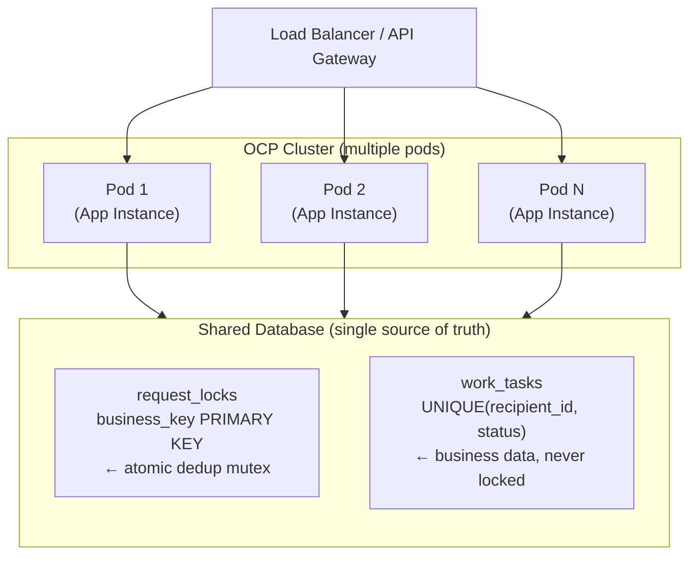
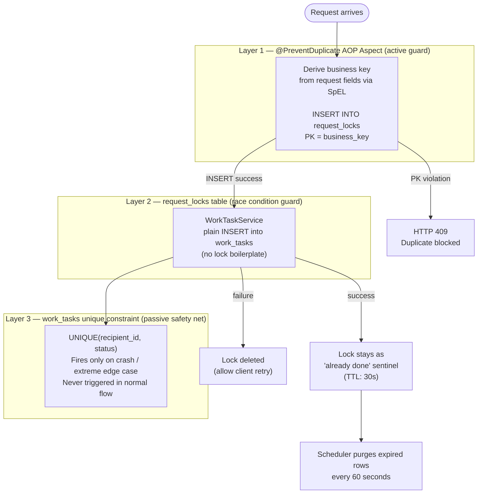
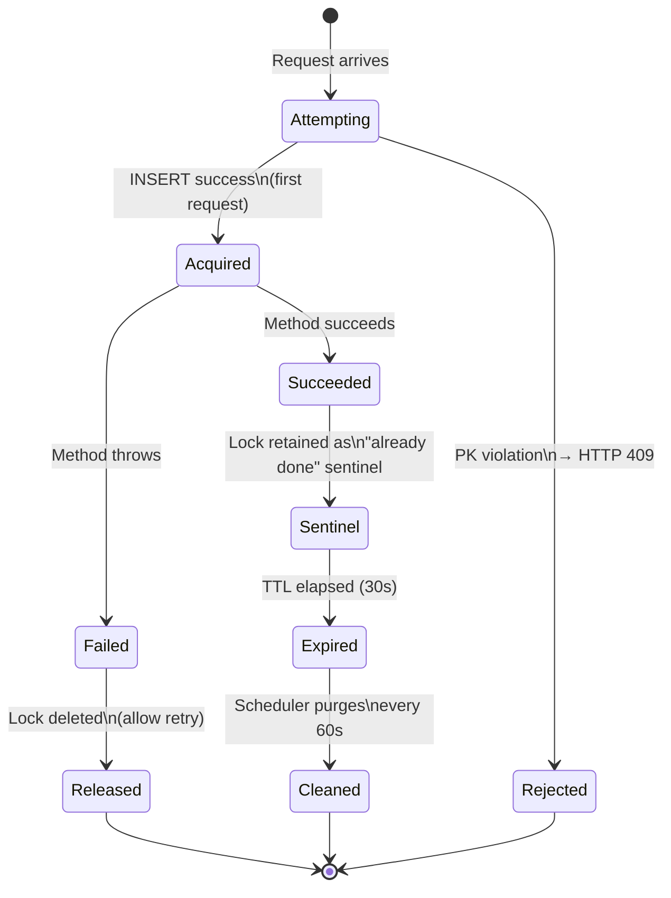

# Sentinel Component

A **production-ready Spring Boot** component that prevents duplicate work task creation when users click a UI button multiple times. Works correctly across **multiple pods sharing a single database** (single-cluster OCP deployment) — no Redis or external coordination service required.

---

## Quick Start

```bash
# Requires Java 17+ and Gradle (or use the wrapper)
git clone <repo>
cd sentinel-demo

# Run the application
./gradlew bootRun

# Run all tests (including concurrent duplicate test)
./gradlew test
```

| Endpoint | URL |
|---|---|
| API Base | http://localhost:8080/api/v1/work-tasks |
| H2 Console | http://localhost:8080/h2-console |
| Health Check | http://localhost:8080/actuator/health |

> H2 Console credentials: JDBC URL `jdbc:h2:mem:worktaskdb` · User `sa` · Password *(empty)*

---

## The Problem

A UI button triggers `POST /api/v1/work-tasks`. Users sometimes click it twice — accidentally or intentionally. This creates duplicate `WorkTask` records for the same recipient, which violates business rules.

```
User double-clicks
      │
      ├──► Click 1 ──► POST /api/v1/work-tasks ──► WorkTask #1 created ✓
      │
      └──► Click 2 ──► POST /api/v1/work-tasks ──► WorkTask #2 created ✗  ← must stop this
```

The challenge: **both requests can arrive within milliseconds**, before either has finished. A simple database `existsBy` check is not safe because both threads can pass the check before either commits.

### Multi-Node Cluster Problem



When multiple pods receive simultaneous requests for the same recipient, naive deduplication strategies — such as `SELECT + INSERT` or `existsBy` checks — fail because both threads pass the existence check before either commits.

---

## Architecture Overview



All pods share **one database**. The `INSERT` into `request_locks` is atomic at the DB level — only one pod wins the race regardless of how many attempt simultaneously.

---

## Three-Layer Defense



### Layer 1 — AOP Aspect (primary guard)

The `@PreventDuplicate` annotation intercepts the method before any business logic runs. It:

1. Derives a **business key** from method arguments using SpEL expressions
2. Attempts `INSERT INTO request_locks` where `business_key` is the **PRIMARY KEY**
3. If INSERT succeeds → first request → proceed
4. If INSERT fails (PK violation) → duplicate → throw `DuplicateRequestException` → HTTP 409

### Layer 2 — `request_locks` table (race condition guard)

The database `PRIMARY KEY` constraint makes the INSERT atomic. Even if 10 pods attempt simultaneously, exactly one will succeed. This is the distributed mutex — **no Redis required**.

### Layer 3 — `work_tasks` unique constraint (passive safety net)

`UNIQUE(recipient_id, status)` catches extreme edge cases (e.g. app crash between lock acquire and INSERT). In normal flow this constraint is **never triggered**.

---

## Why `work_tasks` Is Never Locked

This is a key design decision. Many naive implementations put a `SELECT FOR UPDATE` on `work_tasks`, which blocks concurrent readers:

```
❌ BAD — SELECT FOR UPDATE on work_tasks
   Thread 1: SELECT * FROM work_tasks WHERE recipient_id=X FOR UPDATE
                                                              ↑
   Thread 2: SELECT * FROM work_tasks WHERE status='ACTIVE'  │
             ← BLOCKED, waiting for Thread 1's lock to release ┘

   Other features reading unassigned tasks are now stuck.
```

Our design keeps all locking in `request_locks` only:

```
✓ GOOD — lock only in request_locks

   Thread 1 (create):  INSERT INTO request_locks (key='CREATE:X')  ← locks 1 row here only
   Thread 2 (read):    SELECT * FROM work_tasks WHERE status='ACTIVE'  ← never blocked
   Thread 3 (update):  UPDATE work_tasks SET status='ASSIGNED' WHERE id=Y  ← never blocked
   Thread 4 (create):  INSERT INTO request_locks (key='CREATE:Y')  ← independent lock

   work_tasks has ZERO locks from our mechanism.
```

---

## Lock Table Lifecycle



The `request_locks` table is intentionally tiny. At any moment it holds only:
- Rows for in-flight requests (typically < 1 second each)
- Rows acting as "already done" sentinels within their TTL window
- Expired rows waiting for the 60-second cleanup cycle

In a typical application this table has **fewer than 10 rows** at any given time.

---

## Row-Level Locking Explained

When Spring/Hibernate executes a plain `INSERT` or `UPDATE`, the database uses **row-level locks** — not table locks:

```
work_tasks table during concurrent operations:

  ┌─────────────────────────────────────────────────────┐
  │  id   │ recipient_id │ status    │ Row lock?        │
  ├───────┼──────────────┼───────────┼──────────────────┤
  │  101  │   Alice      │  ACTIVE   │ 🔒 (being updated) │ ← only this row
  │  102  │   Bob        │  ACTIVE   │ ✓ free           │ ← unaffected
  │  103  │   Carol      │  UNASSIGNED│ ✓ free          │ ← unaffected
  │  104  │   Dave       │  UNASSIGNED│ ✓ free          │ ← unaffected
  └─────────────────────────────────────────────────────┘

  SELECT * FROM work_tasks WHERE status='UNASSIGNED'
  ← reads Carol and Dave freely, zero wait, not blocked by Alice's row lock
```

| Operation | Lock scope | Blocks readers? |
|---|---|---|
| `SELECT` (READ COMMITTED) | None | No |
| `INSERT` | New row only | No |
| `UPDATE WHERE id=X` | Row X only | No (READ COMMITTED) |
| `SELECT FOR UPDATE` | Every matched row | Yes ← **we never use this** |
| `LOCK TABLE` | Entire table | Yes ← **never happens in app code** |

---

## Scaling to Multiple Clusters

This solution works perfectly for **single cluster, multiple pods** (all pods share one DB).

For **multi-cluster** deployments where each cluster has its own database, three strategies exist:



1. **API Gateway dedup filter** — deduplicate at the gateway layer before requests reach pods
2. **Shared lock datasource** — all clusters point to a single shared `request_locks` database
3. **DB unique constraint only** — rely solely on the `UNIQUE(recipient_id, status)` constraint with eventual consistency

---

## How to Apply to Other Endpoints

Adding duplicate protection to any service method takes **one annotation**:

```java
// Any service method — just add @PreventDuplicate
@PreventDuplicate(
    operation  = "SEND_NOTIFICATION",         // unique name — scopes the key
    keyParts   = {"#req.userId()",            // SpEL from method args
                  "#req.notificationType()"},
    ttlSeconds = 30
)
public NotificationResponse sendNotification(SendNotificationRequest req) {
    // Zero duplicate-prevention boilerplate here
    // The aspect handles everything
}
```

The `operation` field prevents collisions — `recipientId = "ABC"` in two different endpoints produces keys `CREATE_WORK_TASK:ABC` and `SEND_NOTIFICATION:ABC` — completely isolated.

---

## Project Structure

```
sentinel-demo/
├── build.gradle                          ← Gradle build (Java 17, Spring Boot 3.2.3)
├── settings.gradle
├── docs/
│   ├── multi_node_cluster_problem.svg    ← problem illustration
│   └── multi_cluster_solution_architecture.svg  ← multi-cluster solution diagram
│
└── src/
    ├── main/
    │   ├── java/com/demo/worktask/
    │   │   ├── WorkTaskApplication.java          ← entry point
    │   │   │
    │   │   ├── annotation/
    │   │   │   └── PreventDuplicate.java         ← @PreventDuplicate annotation
    │   │   │
    │   │   ├── aspect/
    │   │   │   └── DuplicateRequestAspect.java   ← AOP engine (core of the solution)
    │   │   │
    │   │   ├── config/
    │   │   │   ├── AppConfig.java                ← request ID MDC filter
    │   │   │   └── GlobalExceptionHandler.java   ← unified error responses
    │   │   │
    │   │   ├── controller/
    │   │   │   └── WorkTaskController.java       ← REST endpoints
    │   │   │
    │   │   ├── dto/
    │   │   │   ├── CreateWorkTaskRequest.java
    │   │   │   ├── UpdateWorkTaskRequest.java
    │   │   │   ├── WorkTaskResponse.java
    │   │   │   └── ErrorResponse.java
    │   │   │
    │   │   ├── entity/
    │   │   │   ├── WorkTask.java                 ← business entity (never locked)
    │   │   │   └── RequestLock.java              ← lock table entity
    │   │   │
    │   │   ├── exception/
    │   │   │   ├── DuplicateRequestException.java
    │   │   │   ├── WorkTaskNotFoundException.java
    │   │   │   └── LockAcquisitionException.java
    │   │   │
    │   │   ├── repository/
    │   │   │   ├── WorkTaskRepository.java
    │   │   │   └── RequestLockRepository.java
    │   │   │
    │   │   ├── scheduler/
    │   │   │   └── LockCleanupScheduler.java     ← purges expired locks every 60s
    │   │   │
    │   │   └── service/
    │   │       └── WorkTaskService.java          ← clean business logic
    │   │
    │   └── resources/
    │       ├── application.yml
    │       └── db/migration/
    │           └── V1__initial_schema.sql        ← Flyway migration
    │
    └── test/
        └── java/com/demo/worktask/
            └── WorkTaskIntegrationTest.java      ← full test suite incl. concurrency test
```

---

## API Reference

### Create Work Task
```http
POST /api/v1/work-tasks
Content-Type: application/json

{
  "recipientId": "550e8400-e29b-41d4-a716-446655440000",
  "title": "Fix login bug",
  "description": "Users cannot login on mobile",
  "createdBy": "admin"
}
```

**Responses:**
- `201 Created` — task created successfully
- `409 Conflict` — duplicate request (same recipientId already has an active task)
- `400 Bad Request` — validation error

### Get Work Tasks by Status
```http
GET /api/v1/work-tasks?status=ACTIVE
GET /api/v1/work-tasks?status=ACTIVE&paged=true&page=0&size=20
```

### Get Tasks for a Recipient
```http
GET /api/v1/work-tasks/recipient/{recipientId}
```

### Update Status
```http
PATCH /api/v1/work-tasks/{id}/status
Content-Type: application/json

{ "status": "COMPLETED" }
```

Valid statuses: `ACTIVE`, `COMPLETED`, `CANCELLED`

### Delete
```http
DELETE /api/v1/work-tasks/{id}
```

---

## Testing the Duplicate Prevention

### Manual test with curl

```bash
RECIPIENT="550e8400-e29b-41d4-a716-446655440000"
BODY="{\"recipientId\":\"$RECIPIENT\",\"title\":\"Test\",\"description\":\"desc\",\"createdBy\":\"admin\"}"

# First click — should return 201
curl -s -o /dev/null -w "%{http_code}" -X POST http://localhost:8080/api/v1/work-tasks \
  -H "Content-Type: application/json" -d "$BODY"
# → 201

# Second click — should return 409
curl -s -o /dev/null -w "%{http_code}" -X POST http://localhost:8080/api/v1/work-tasks \
  -H "Content-Type: application/json" -d "$BODY"
# → 409
```

### Simulate concurrent double-click (parallel curl)

```bash
RECIPIENT="660e8400-e29b-41d4-a716-446655440001"
BODY="{\"recipientId\":\"$RECIPIENT\",\"title\":\"Concurrent\",\"description\":\"test\",\"createdBy\":\"admin\"}"

# Fire 5 requests simultaneously
for i in {1..5}; do
  curl -s -o /dev/null -w "Request $i: %{http_code}\n" \
    -X POST http://localhost:8080/api/v1/work-tasks \
    -H "Content-Type: application/json" -d "$BODY" &
done
wait

# Expected output: exactly one 201, four 409s
```

### Run the automated concurrency test

```bash
./gradlew test --tests "com.demo.worktask.WorkTaskIntegrationTest.createWorkTask_concurrentDuplicatesPrevented"
```

The test fires 5 concurrent threads at the same `recipientId` and asserts exactly 1 succeeds and 4 get 409.

---

## Configuration

```yaml
# application.yml
app:
  lock:
    ttl-seconds: 30          # how long a lock is held after success
    cleanup-interval-ms: 60000  # how often the scheduler purges expired rows

logging:
  level:
    com.demo.worktask: DEBUG   # set to INFO in production
```

---

## Technology Stack

| Component | Technology |
|---|---|
| Framework | Spring Boot 3.2.3 |
| Build | Gradle 8.6 |
| Java | 17 |
| Database | H2 (dev) / PostgreSQL, MySQL (prod) |
| Migrations | Flyway |
| Duplicate guard | AOP + DB `PRIMARY KEY` constraint |
| Lock table | `request_locks` (dedicated, tiny) |
| Logging | SLF4J + Logback with MDC request ID |
